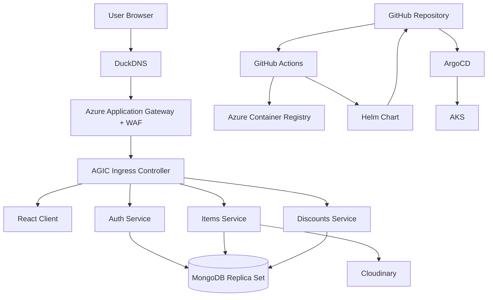

# README.md

# Restauranty — End-to-End DevOps Deployment

Restauranty is a cloud-native microservices application deployed on Azure Kubernetes Service (AKS) using a modern DevOps and GitOps workflow.

The project demonstrates:

* Kubernetes microservices architecture
* GitOps with ArgoCD
* Helm-based deployments
* CI/CD with GitHub Actions
* Azure Container Registry (ACR)
* Azure Application Gateway Ingress Controller (AGIC)
* Network Policies for pod isolation
* MongoDB replica set on Kubernetes
* TLS termination with custom domain
* Infrastructure as Code with Terraform
* Centralized logging with Loki + Alloy
* Monitoring with Grafana and Prometheus

---

# Live Architecture



---

# Tech Stack

| Category                | Technology                  |
| ----------------------- | --------------------------- |
| Cloud                   | Microsoft Azure             |
| Container Orchestration | Kubernetes (AKS)            |
| GitOps                  | ArgoCD                      |
| Packaging               | Helm                        |
| CI/CD                   | GitHub Actions              |
| Container Registry      | Azure Container Registry    |
| Ingress                 | Azure Application Gateway   |
| Backend                 | Node.js / Express           |
| Frontend                | React                       |
| Database                | MongoDB Replica Set         |
| Infrastructure as Code  | Terraform                   |
| Logging                 | Grafana Loki + Alloy        |
| Security                | Kubernetes Network Policies |

---

# Project Structure

```text
.
├── apps
│   ├── backend
│   └── client
│
├── ARCHITECTURE.md
├── argocd
│   └── restauranty.yml
├── COMPLIANCE.md
├── docs
│   └── images
├── helm
│   └── restauranty
├── k8s
│   ├── backend
│   ├── client
│   ├── hpa
│   ├── ingress
│   ├── namespaces
│   ├── secrets
│   └── security
├── logging
│   ├── alloy
│   └── loki
├── README.md
├── RUNBOOK.md
├── scripts
│   ├── build-push-acr.sh
│   └── deploy.sh
├── SECURITY.md
├── terraform
│   ├── environments
│   └── modules
└── tls
```

---

# CI/CD + GitOps Workflow

```mermaid
flowchart LR

    Dev[Developer Push]

    Actions[GitHub Actions]

    Build[Build Docker Images]

    Push[Push Images to ACR]

    Update[Update Helm values.yaml]

    Git[Push Changes to GitHub]

    Argo[ArgoCD Detects Changes]

    Helm[Helm Renders Templates]

    AKS[Deploy to AKS]

    Dev --> Actions

    Actions --> Build

    Build --> Push

    Push --> Update

    Update --> Git

    Git --> Argo

    Argo --> Helm

    Helm --> AKS
```



---

# Features

## Infrastructure

* Terraform-based infrastructure provisioning
* Modular Terraform architecture
* AKS cluster
* Azure Container Registry
* Application Gateway
* Virtual Network and Subnets
* TLS certificates

## Kubernetes

* Namespaces
* Deployments
* Services
* Ingress
* Horizontal Pod Autoscaler
* Secrets
* Network Policies

## Security

* HTTPS with TLS
* NSG protection
* Pod-to-pod isolation with NetworkPolicies
* Database namespace isolation
* Least-privilege network communication
* Secret-based configuration

## GitOps

* Declarative deployments
* Automated synchronization
* Drift detection
* Self-healing deployments

---

# Deployment

## Build and Deploy

```bash
git push origin develop
```

The deployment pipeline automatically:

1. Detects changed services
2. Builds Docker images
3. Pushes images to ACR
4. Updates Helm values
5. Pushes deployment state to Git
6. ArgoCD syncs AKS

---

# Access

| Service  | URL                                                                |
| -------- | ------------------------------------------------------------------ |
| Frontend | [https://restauranty.duckdns.org](https://restauranty.duckdns.org) |
| ArgoCD   | Internal / LoadBalancer                                            |
|          |                                                                    |

