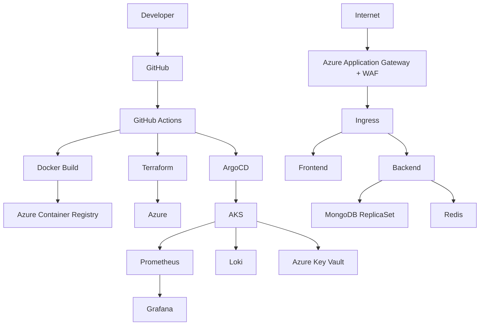

# 🍽️ Restauranty Cloud Platform

> **Production-Style Cloud Platform on Microsoft Azure**

A cloud-native platform engineered to demonstrate modern Platform Engineering practices using **Azure Kubernetes Service (AKS)**, **Terraform**, **GitOps**, **GitHub Actions**, and enterprise-grade observability.

Unlike a traditional application-focused project, Restauranty emphasizes the design, automation, deployment, and operation of a production-style cloud platform.

---

## Key Highlights

- ☁️ Azure Kubernetes Service (AKS)
- 🏗️ Infrastructure as Code with Terraform
- 🔄 GitOps Continuous Delivery using ArgoCD
- 🚀 CI/CD automation with GitHub Actions
- 🔐 Secure secret management with Azure Key Vault
- 🛡️ Azure Application Gateway + Web Application Firewall (WAF)
- 📦 Helm-based Kubernetes deployments
- 📈 Horizontal Pod Autoscaler (HPA)
- 📊 Production monitoring with Prometheus & Grafana
- 📝 Centralized logging with Loki
- 🍃 MongoDB ReplicaSet deployment
- 🐳 Dockerized microservices

---

# Platform Architecture



---

# Platform Overview

Restauranty is designed to simulate how a modern cloud-native platform is built and operated in production.

The project focuses on Platform Engineering rather than application development by covering the complete software delivery lifecycle:

- Infrastructure provisioning
- Kubernetes platform operations
- GitOps deployment
- CI/CD automation
- Security
- Observability
- High availability
- Scalability

---

# Technology Stack

| Category | Technologies |
|------------|-----------------------------|
| Cloud | Microsoft Azure |
| Kubernetes | Azure Kubernetes Service |
| IaC | Terraform |
| GitOps | ArgoCD |
| CI/CD | GitHub Actions |
| Containers | Docker |
| Packaging | Helm |
| Database | MongoDB ReplicaSet |
| Cache | Redis |
| Monitoring | Prometheus, Grafana |
| Logging | Loki |
| Secrets | Azure Key Vault |
| Networking | Azure Application Gateway, WAF |
| Languages | Node.js, React |

---

# Infrastructure Components

## Compute

- Azure Kubernetes Service (AKS)
- Multiple Deployments
- Horizontal Pod Autoscaler

## Networking

- Azure Virtual Network
- Application Gateway
- Azure Load Balancer
- Ingress Controller
- Web Application Firewall

## Security

- Azure Key Vault
- Kubernetes Secrets
- TLS Certificates
- RBAC

## Storage

- Persistent Volumes
- MongoDB ReplicaSet
- Azure Storage

## Observability

- Prometheus
- Grafana
- Loki

---

# Deployment Workflow

```text
Developer

↓

Git Push

↓

GitHub

↓

GitHub Actions

↓

Build Docker Images

↓

Push to Azure Container Registry

↓

Terraform Provisioning

↓

ArgoCD GitOps Synchronization

↓

Azure Kubernetes Service

↓

Application Available
```

---

# CI/CD Pipeline

The platform uses GitHub Actions to automate:

- Build
- Test
- Docker image creation
- Container Registry publishing
- Infrastructure deployment
- GitOps synchronization

---

# Security

Security was considered throughout the platform design.

Implemented features include:

- Azure Key Vault
- Kubernetes Secrets
- TLS
- Web Application Firewall
- Secure container registry authentication
- Least privilege access

---

# Repository Structure

```
restauranty-platform/

├── backend/
├── frontend/
├── terraform/
├── kubernetes/
├── helm/
├── monitoring/
├── database/
├── scripts/
├── docs/
└── .github/
```

---

# Lessons Learned

During this project I gained practical experience with:

- Designing Kubernetes platforms on Azure
- Infrastructure as Code using Terraform
- GitOps workflows with ArgoCD
- Building CI/CD pipelines using GitHub Actions
- Operating MongoDB on Kubernetes
- Monitoring Kubernetes workloads
- Managing secrets securely
- Troubleshooting Kubernetes networking
- Designing production-style cloud infrastructure

---

# Future Improvements

The platform is intentionally designed as an evolving engineering project.

Planned enhancements include:

- Trivy image scanning
- Velero backup & disaster recovery
- Policy as Code (Kyverno / OPA)
- Azure Monitor integration
- Cost optimization
- Multi-environment deployments
- Automated security scanning

---

# About This Project

This project was developed as a hands-on Platform Engineering initiative to explore production-style cloud infrastructure on Microsoft Azure.

The primary objective is to demonstrate modern DevOps and Platform Engineering practices including Infrastructure as Code, GitOps, Kubernetes operations, CI/CD automation, observability, and secure cloud deployments.

Application source code originated from an existing sample application. The cloud infrastructure, Kubernetes platform, deployment automation, GitOps workflow, monitoring stack, and operational architecture were designed and implemented as part of this Platform Engineering project.

---

## License

MIT License