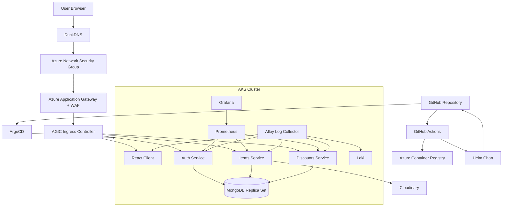

# Restauranty — End-to-End DevOps Deployment

Restauranty is a cloud-native microservices platform deployed on Azure Kubernetes Service (AKS) using modern DevOps, GitOps, Kubernetes, and cloud security practices.

The project demonstrates production-style platform engineering concepts including:

* Kubernetes microservices architecture
* GitOps with ArgoCD
* Helm-based deployments
* CI/CD with GitHub Actions
* Azure Kubernetes Service (AKS)
* Azure Container Registry (ACR)
* Azure Application Gateway Ingress Controller (AGIC)
* Azure WAF_v2
* Kubernetes Network Policies
* MongoDB replica set deployment
* Terraform Infrastructure as Code
* Prometheus + Grafana monitoring
* Loki + Alloy centralized logging
* TLS/HTTPS ingress security

---

# Architecture Overview



---

# CI/CD + GitOps Workflow

```mermaid
flowchart LR

    Dev[Developer Push]

    Actions[GitHub Actions]

    Build[Build Docker Images]

    Push[Push Images to ACR]

    Update[Update Helm values.yaml]

    Git[Push Changes to GitHub]

    Argo[ArgoCD Detects Changes]

    Helm[Helm Renders Templates]

    AKS[Deploy to AKS]

    Dev --> Actions

    Actions --> Build

    Build --> Push

    Push --> Update

    Update --> Git

    Git --> Argo

    Argo --> Helm

    Helm --> AKS
```



---

# Tech Stack

| Category                | Technology                              |
| ----------------------- | --------------------------------------- |
| Cloud                   | Microsoft Azure                         |
| Container Orchestration | Kubernetes (AKS)                        |
| GitOps                  | ArgoCD                                  |
| Packaging               | Helm                                    |
| CI/CD                   | GitHub Actions                          |
| Container Registry      | Azure Container Registry                |
| Ingress                 | Azure Application Gateway + AGIC        |
| Frontend                | React                                   |
| Backend                 | Node.js / Express                       |
| Database                | MongoDB Replica Set                     |
| Infrastructure as Code  | Terraform                               |
| Monitoring              | Prometheus + Grafana                    |
| Logging                 | Loki + Alloy                            |
| Security                | Azure WAF + Kubernetes Network Policies |

---

# Kubernetes Architecture

The platform consists of multiple microservices deployed within AKS.

| Service   | Purpose                       | Port  |
| --------- | ----------------------------- | ----- |
| client    | React frontend                | 80    |
| auth      | Authentication service        | 3001  |
| items     | Product management service    | 3003  |
| discounts | Coupon management service     | 3002  |
| mongodb   | Stateful replica set database | 27017 |

---

# Infrastructure Components

## Azure Kubernetes Service (AKS)

The platform runs on Azure Kubernetes Service with:

* Multiple backend microservices
* Namespace isolation
* Horizontal Pod Autoscalers
* Ingress routing
* NetworkPolicies
* Stateful workloads

---

## Azure Application Gateway + AGIC

Ingress traffic is managed through:

* Azure Application Gateway
* AGIC (Application Gateway Ingress Controller)
* HTTPS/TLS termination
* Path-based routing
* WAF protection

---

## Azure WAF_v2

The project includes Azure Web Application Firewall (WAF) configured with:

* OWASP Core Rule Set 3.2
* Detection mode
* Centralized firewall logging
* Azure Monitor integration

---

# Security Architecture

Restauranty implements layered cloud-native security across Azure infrastructure, Kubernetes networking, ingress traffic, and application workloads.

## Security Layers

```text
Internet
↓
Azure Network Security Group (NSG)
↓
Azure Application Gateway + WAF
↓
AGIC Ingress Controller
↓
Kubernetes Network Policies
↓
Microservices
```

---

## Kubernetes Network Policies

The cluster uses Kubernetes NetworkPolicies for pod-level microsegmentation.

Implemented policies include:

* Default deny ingress/egress
* Controlled pod-to-pod communication
* Namespace isolation
* MongoDB access restrictions
* DNS egress policies
* Internal-only database communication

Allowed traffic examples:

| Source    | Destination |
| --------- | ----------- |
| client    | auth        |
| client    | items       |
| client    | discounts   |
| auth      | mongodb     |
| items     | mongodb     |
| discounts | mongodb     |

---

## WAF Monitoring

WAF logs are centralized through Azure Monitor and Log Analytics.

Current WAF configuration:

| Feature                   | Status    |
| ------------------------- | --------- |
| WAF SKU                   | WAF_v2    |
| Rule Set                  | OWASP 3.2 |
| Mode                      | Detection |
| Firewall Logs             | Enabled   |
| Log Analytics Integration | Enabled   |

---

## WAF Detection Mode Stabilization

The WAF currently operates in Detection Mode to safely observe application traffic patterns and identify false positives before enabling active request blocking.

This stabilization phase includes:

* Monitoring suspicious requests
* Reviewing OWASP rule matches
* Validating frontend/API compatibility
* Observing authentication flows
* Testing upload endpoints
* Evaluating legitimate traffic behavior

Future migration path:

```text
Detection
↓
False-positive analysis
↓
Rule tuning
↓
Prevention mode
```

---

# Observability Stack

The platform includes a full observability stack.

## Monitoring

Prometheus collects metrics from Kubernetes workloads and services.

Grafana provides dashboards and visualization.

Metrics include:

* Pod health
* Resource utilization
* Service availability
* Kubernetes metrics

---

## Centralized Logging

Logging pipeline:

```text
Applications
↓
Alloy
↓
Loki
↓
Grafana
```

Features:

* Centralized log aggregation
* Pod-level log analysis
* Kubernetes troubleshooting
* Operational visibility

---

# Terraform Infrastructure

Infrastructure is provisioned using Terraform modules.

## Modules

| Module              | Purpose                     |
| ------------------- | --------------------------- |
| network             | Virtual network and subnets |
| aks                 | AKS cluster                 |
| acr                 | Azure Container Registry    |
| application_gateway | Ingress + WAF               |
| key_vault           | Secret management           |

---

# GitOps Deployment Model

Deployments follow GitOps principles.

## Workflow

1. Developer pushes code
2. GitHub Actions builds Docker images
3. Images are pushed to ACR
4. Helm values are updated automatically
5. ArgoCD detects Git changes
6. AKS reconciles desired state

Benefits:

* Declarative deployments
* Automatic reconciliation
* Drift detection
* Version-controlled infrastructure
* Rollback through Git history

---

# Project Structure

```text
.
├── apps
│   ├── backend
│   │   ├── auth
│   │   ├── discounts
│   │   └── items
│   └── client
│
├── argocd
│   └── restauranty.yml
│
├── helm
│   └── restauranty
│       ├── Chart.yaml
│       ├── values.yaml
│       └── templates
│
├── k8s
│   ├── backend
│   ├── ingress
│   ├── security
│   ├── secrets
│   └── hpa
│
├── logging
│   ├── alloy
│   └── loki
│
├── terraform
│   ├── environments
│   └── modules
│
└── .github
    └── workflows
```

---

# Deployment

## CI/CD Deployment

```bash
git push origin develop
```

The pipeline automatically:

1. Detects changed services
2. Builds multi-architecture Docker images
3. Pushes images to ACR
4. Updates Helm deployment values
5. Pushes deployment state to Git
6. ArgoCD synchronizes AKS

---

# Access

| Service  | URL                             |
| -------- | ------------------------------- |
| Frontend | https://restauranty.duckdns.org |

---

# Future Improvements

Planned enhancements include:

* WAF Prevention Mode
* Custom WAF rules
* Login rate limiting
* Geo-blocking policies
* Grafana WAF dashboards
* Azure Key Vault CSI Driver
* OPA/Gatekeeper policy enforcement
* Kubernetes RBAC hardening
* Image vulnerability scanning
* Prometheus alerting
* Service mesh adoption

---

# Key Learning Areas

This project demonstrates hands-on experience with:

* Kubernetes administration
* GitOps workflows
* Cloud-native security
* Infrastructure as Code
* CI/CD engineering
* Azure cloud architecture
* Observability platforms
* Container orchestration
* Microservices networking
* Production-style platform operations

---

# Author

Lan Anh Tran

Cloud / DevOps / Platform Engineering Project

```
```
